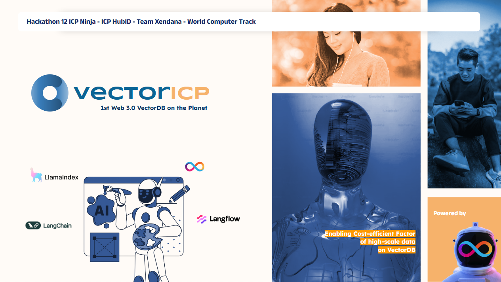
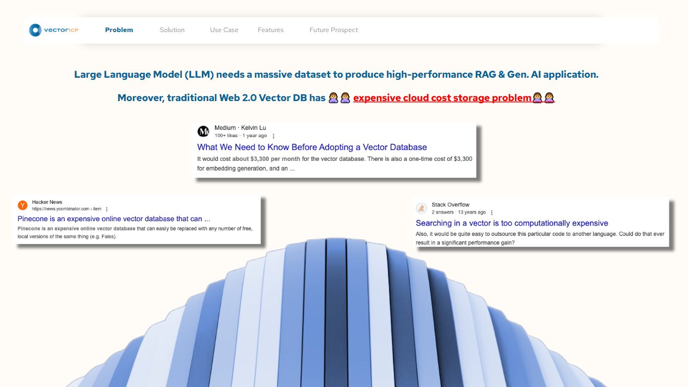
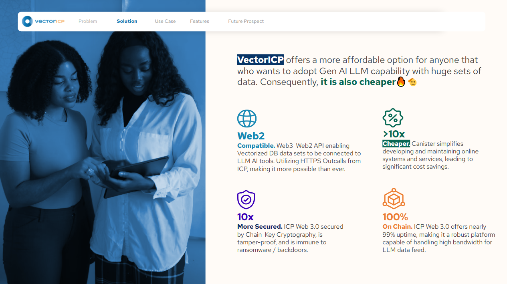
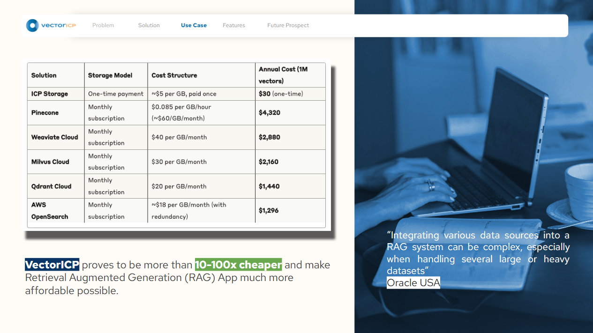
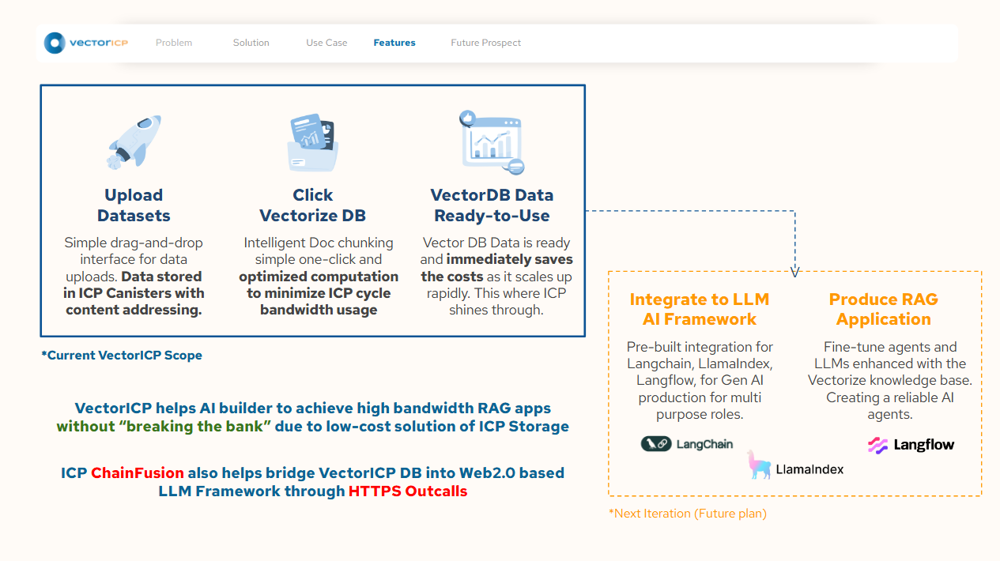
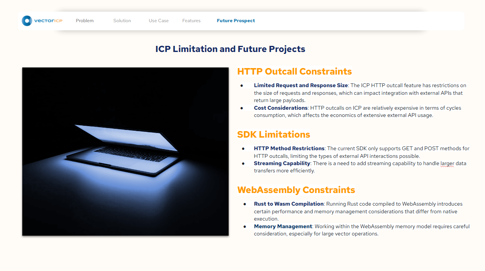

<h1 align="center">
    <a href="#">
        
    </a>
</h1>


# `VectorICP - The Pinecone VectorDB of Web 3.0`
CodeFest ICP Ninja Hackathon 12 - World Computer Track

<h1 align="center">
    </a>
</h1>

## Official Pitch Deck
https://docs.google.com/presentation/d/1DE9rTY7l8FGGzRagHoQzUCcE_x8jAVlRhoIlADme6-I/edit?usp=sharing

## ICP Canister 
**Frontend:** https://w7gvm-haaaa-aaaap-qpyxa-cai.icp0.io/

**Backend:** https://a4gq6-oaaaa-aaaab-qaa4q-cai.raw.icp0.io/?id=wwf6q-riaaa-aaaap-qpywq-cai

## Project Overview
### Purpose
VectorICP aims to provide a secure, efficient, and decentralized solution for managing knowledge bases using embeddings stored within the Internet Computer Protocol (ICP). Leveraging vector embeddings and Hierarchical Navigable Small World (HNSW) indexing, it enables powerful semantic search and retrieval functionality, 
the goals are enhancing the capabilities of Retrieval-Augmented Generation (RAG) systems directly within ICP on-chain.

<h1 align="center">
    </a>
</h1>

### We are aiming to tackle expensive cost to vectorize/indexing high-volume Data for RAG
The primary target audience includes:
- Developers and organizations interested in decentralized storage and retrieval of knowledge bases.

- Teams building Retrieval-Augmented Generation (RAG) applications.

- Researchers and enthusiasts exploring the intersection of blockchain technology, decentralized computing (ICP), and AI/ML embedding models.

<h1 align="center">
    </a>
</h1>
<h1 align="center">
    </a>
</h1>

### How the VectorICP works
<h1 align="center">
    </a>
</h1>

### Video Demo Walkthrough

[](https://youtu.be/bIrup5YeLN4)

### Project Information
This project is built on the Internet Computer Protocol (ICP) platform using Rust and leverages various technologies and libraries:

ICP (Internet Computer Protocol): Decentralized computing platform providing scalable smart contract execution.

Rust & IC-CDK: Efficient backend programming language with robust support for ICP canister development.

HNSW: Advanced indexing for vector embeddings, enabling fast semantic search.

OpenAI Embedding: Integration with OpenAI APIs for generating accurate vector embeddings.

Stable Memory (ic-stable-structures): Persistent, scalable storage solution provided by ICP, enabling the handling of large datasets up to 500 GB per canister.

This combination ensures scalability, reliability, and performance, positioning the project uniquely at the intersection of blockchain decentralization and cutting-edge AI.

## Tech Stack
-** Frontend**: React with Vite and Tailwind CSS, deployed as a dedicated frontend canister on-chain for seamless integration with the ICP backend.

- **Backend**: Rust and IC-CDK for backend logic, storage, and embedding handling.

- **Indexing & Search**: HNSW vector indexing for efficient semantic search.

- **Embedding Generation**: OpenAI API via rag-toolchain integration.

- **Storage**: ICP Stable Memory for persistent and large-scale data management.

This combination ensures scalability, reliability, and performance, positioning the project uniquely at the intersection of blockchain decentralization and cutting-edge AI


## Core Features and Areas

### 1. Document Management System
- **Purpose**: Store, organize, and manage knowledge documents securely on the Internet Computer blockchain.
- **Core functionality**: Upload, view, download, and delete documents with metadata management.
- **Technical implementation**: Uses ICP stable memory for persistent storage with efficient querying.
- **User interactions**: Intuitive web interface with drag-and-drop uploading, document previews, and organization tools.

### 2. Vector Embeddings & Storage
- **Purpose**: Transform documents into vector embeddings for semantic understanding.
- **Core functionality**: Generate, store, and index high-dimensional vector embeddings from document content.
- **Technical implementation**: Implements HNSW (Hierarchical Navigable Small World) indexing for fast approximate nearest neighbor search.
- **Performance**: Optimized for speed and memory efficiency with customizable parameters for precision/recall trade-offs.

### 3. Semantic Search Engine
- **Purpose**: Enable powerful content discovery through meaning-based search rather than keyword matching.
- **Core functionality**: Query vector embeddings to find semantically similar content across the knowledge base.
- **Technical implementation**: Uses cosine similarity with efficient vector operations for relevance ranking.
- **User interactions**: Clean search interface with highlighted results and relevance indicators.

### 4. Security & Access Control
- **Purpose**: Ensure document security and appropriate access permissions.
- **Core functionality**: Internet Identity integration, ownership verification, and granular permission settings.
- **Technical implementation**: Leverages ICP's principal-based security model with custom authorization checks.
- **User interactions**: Simple role assignment interface with clear permission indicators.

## Current Limitations

VectorICP, like any project built on the Internet Computer Protocol, comes with certain limitations that developers should be aware of:

<h1 align="center">
    </a>
</h1>

## Development Guidelines

### Frontend Development
Frontend built with React + TypeScript + Tailwind CSS, deployed as an ICP canister.

- **Design System**
  - **Color Palette**: Primary (#0e79b8), Secondary (#f5b36b), Accent colors (#66a6d2, #3f90c7)
  - **Typography**: Sans-serif fonts for readability with consistent heading hierarchy
  - **Components**: Use atomic design principles with consistent styling patterns

- **React Best Practices**
  - Functional components with hooks for state management
  - Custom hooks for reusable logic
  - Proper error boundaries and loading states
  - Memoization for performance optimization

- **State Management**
  - Redux with Redux Toolkit for global application state
  - Clear action and reducer patterns
  - Proper handling of async operations with thunks

- **Testing & Quality**
  - Component unit tests with React Testing Library
  - Integration tests for critical user flows
  - Accessibility testing and keyboard navigation support

### Backend Development
Backend written in Rust, leveraging the Internet Computer Protocol's capabilities.

- **Code Organization**
  - Clear separation of concerns between modules
  - Well-defined interfaces between components
  - Comprehensive error handling with custom error types
  - Detailed comments and documentation

- **Vector Database Implementation**
  - Efficient serialization/deserialization of embeddings
  - Optimized HNSW index configuration for performance
  - Batched operations for memory efficiency
  - Versioned schema design for future upgrades

- **API Design**
  - RESTful patterns for resource operations
  - Clear error responses with helpful messages
  - Proper input validation and sanitization
  - Comprehensive logging for debugging

- **Performance Considerations**
  - Minimize heap allocations
  - Efficient use of stable memory
  - Optimize query execution paths
  - Implement caching strategies for frequent operations

- **Configuration Management**
  - OpenAI API key integration for generating embeddings
  - Environment-specific configuration handling
  - Secure credential management
  - Feature flags for optional functionality


## ICP
- [Quick Start](https://internetcomputer.org/docs/current/developer-docs/setup/deploy-locally)
- [SDK Developer Tools](https://internetcomputer.org/docs/current/developer-docs/setup/install)
- [Rust Canister Development Guide](https://internetcomputer.org/docs/current/developer-docs/backend/rust/)
- [ic-cdk](https://docs.rs/ic-cdk)
- [ic-cdk-macros](https://docs.rs/ic-cdk-macros)
- [Candid Introduction](https://internetcomputer.org/docs/current/developer-docs/backend/candid/)

If you want to start working on your project right away, you might want to try the following commands:

```bash
cd vector_icp/
dfx help
dfx canister --help
```

## OpenAI API Key Configuration

This project requires an OpenAI API key to generate embeddings for documents. You'll need to configure this key before deploying:

1. Obtain an API key from [OpenAI Platform](https://platform.openai.com/api-keys)
2. In your project's `dfx.json` file, locate the backend canister configuration:

```json
"backend": {
  "type": "rust",
  "package": "ic_rag_vec_backend",
  "candid": "src/backend/backend.did",
  "init_arg": "(record {openApiKeys = \"insert your openai api key here\"})"
},
```

3. Replace `"insert your openai api key here"` with your actual OpenAI API key
4. Never commit your API key to version control

## Running the project locally

If you want to test your project locally, you can use the following commands:

```bash
# Starts the replica, running in the background
dfx start --background

# Configure your OpenAI API key in dfx.json
# Find the section with "init_arg" and replace with your key:
# "init_arg": "(record {openApiKeys = \"your-openai-api-key-here\"})"

# Deploys your canisters to the replica and generates your candid interface
dfx deploy
```

Once the job completes, your application will be available at `http://localhost:4943?canisterId={asset_canister_id}`.

If you have made changes to your backend canister, you can generate a new candid interface with

```bash
npm run generate
```

at any time. This is recommended before starting the frontend development server, and will be run automatically any time you run `dfx deploy`.

If you are making frontend changes, you can start a development server with

```bash
npm start
```

Which will start a server at `http://localhost:8080`, proxying API requests to the replica at port 4943.

### Note on frontend environment variables

If you are hosting frontend code somewhere without using DFX, you may need to make one of the following adjustments to ensure your project does not fetch the root key in production:

- set`DFX_NETWORK` to `ic` if you are using Webpack
- use your own preferred method to replace `process.env.DFX_NETWORK` in the autogenerated declarations
  - Setting `canisters -> {asset_canister_id} -> declarations -> env_override to a string` in `dfx.json` will replace `process.env.DFX_NETWORK` with the string in the autogenerated declarations
- Write your own `createActor` constructor
